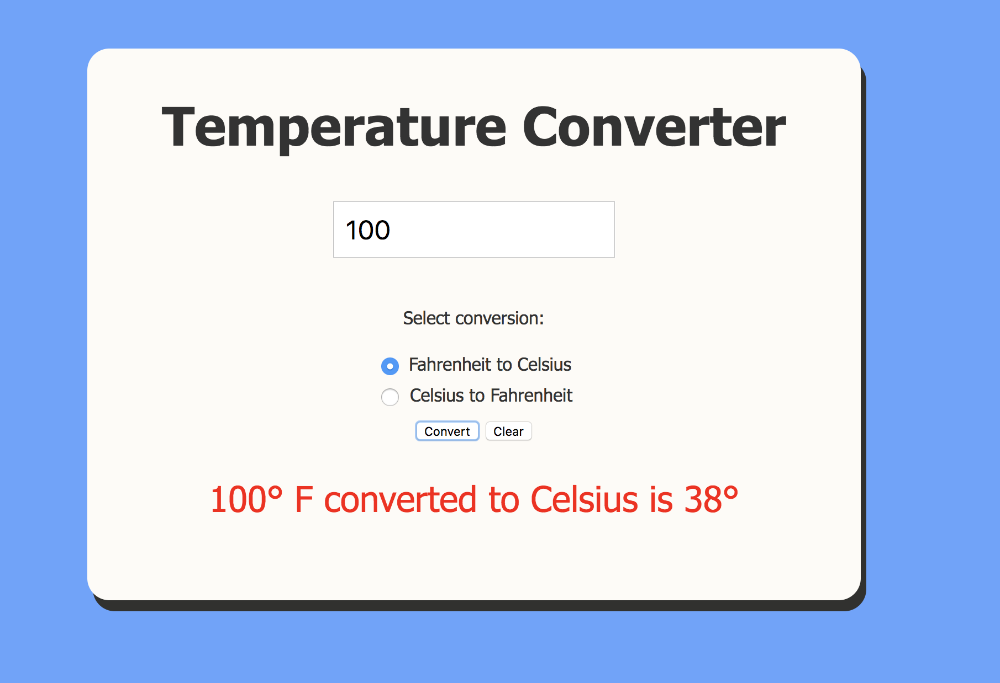

# Temperature Converter

## Description
This is a simple temperature converter app where user can convert temperatures from fahrenheit to celsius, and vice versa. This app was coded using entirely vanilla JavaScript, and CSS.

## Screenshot


## How to run this project
* Clone the repository to your local machine.
* Use npm to install http-server in your terminal:
```sh
npm install -g http-server
```
* Run the server in your terminal
```sh
hs -p 9999
```
* Open chrome and navigate to:
```
localhost: 9999
```
